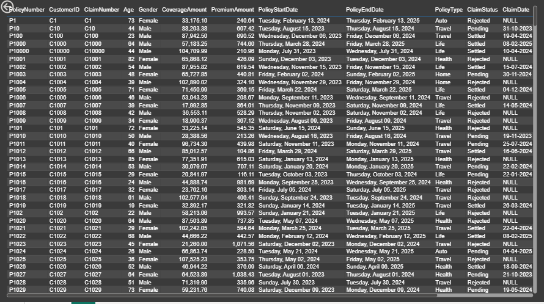

# 📊 Insurance Analytics Dashboard – Power BI

## Overview

This project presents an interactive insurance analytics dashboard developed using SQL Server and Power BI.

The objective was to analyze insurance policy performance, claim distribution, coverage exposure, and operational metrics through structured KPI-based reporting. The dashboard enables multi-dimensional analysis across policy, customer, and claim attributes.

---

## Technology Stack

- SQL Server (CSV ingestion via flat file import)
- Power BI Desktop
- Power Query (data transformation)
- Drill-through functionality
- Row-Level Security (RLS)

---

## Data Flow Architecture

CSV Dataset → SQL Server → Power BI

The dataset was first imported into SQL Server to simulate structured data handling before being connected to Power BI for transformation and reporting.

---

## Business Requirements Addressed

- Total Premium Amount analysis across policy, claim, gender, and customer dimensions
- Total Claim Amount breakdown
- Total Coverage Amount evaluation
- Claim Status distribution analysis
- Claim Amount segmentation by Age Group
- Premium performance by Policy Type
- Active vs Inactive policy comparison
- Coverage Amount by Claim Status under different Policy Types

---

## Features Implemented

- KPI Cards for Premium, Claim, and Coverage amounts
- Interactive slicers (Policy Number, Claim Number, Customer ID)
- Drill-through functionality by Policy Type
- Row-Level Security configured on Policy Type
- Age Group categorization using conditional column logic
- Cross-filtering across visuals
- Matrix visualization for detailed coverage breakdown

---

## Key Insights

- Travel policies generated the highest premium contribution.
- Rejected claims were higher than approved and pending claims.
- Adults represented the highest claim amount segment.
- Inactive policies slightly exceeded active policies.

---

## Repository Structure

- `Insurance Data Analysis.pbix` – Power BI report file  
- `data/InsuranceData.csv` – Dataset used for analysis  
- `screenshots/` – Dashboard visuals  

---

## Screenshots

### Dashboard Overview

### Drill-through Detail View

---

## How to Use

- Use the slicers (Policy Number, Claim Number, Customer ID) to filter the dashboard.
- Click on any Policy Type in the bar chart to drill through to the detailed data view.
- All visuals dynamically update based on selected filters.
- Row-Level Security is configured on Policy Type (assign users to roles in Power BI Service to activate).
